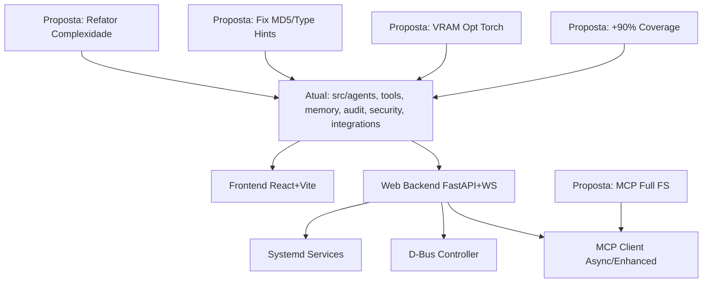

# Relatório de Análise Roo - Projeto OmniMind

## Resumo Executivo
O projeto OmniMind está em estado **production-ready** (Phase 12 completa, ~94% aderência geral). Estrutura robusta com 37k LOC em src/, 16k em tests/. Cobertura de testes 54% (meta 90%), mypy 155 erros, flake8 445 issues. Poucos gaps críticos (6 MD5, TODOs em tests). Roadmap Phases 7/8 ~85% implementada (SecurityAgent, MCP/D-Bus/WebUI presentes, mas integrações parciais).

**Gaps Principais:**
- Test coverage baixa (multimodal/consciousness <50%)
- Type hints incompletos (mypy strict falha)
- Stubs/NotImplemented em tests/quantum_ai
- MD5 em security (vulnerável)

**Oportunidades:**
- Otimizar VRAM (quantização torch para GTX1650)
- Cobertura testes para 90%
- Substituir FS direto por MCP full
- Refatorar complexidade alta (66 funções F-grade)

**Buscas Futuras:**
- Papers AI agents (LangGraph v0.2+)
- Psychoanalytic AI (Freud/Lacan em LLMs)
- PyTorch GTX1650 (FlashAttention-2, bitsandbytes 8bit)

## Arquitetura Atual vs Proposta

## Gaps Identificados (35 matches)
- 8 TODO/FIXME (tests/tools/code_generator.py)
- Stubs/NotImplemented (quantum_optimizer.py, tests)
- Sem gaps em .ts

## Aderência Roadmap Phase 7/8
- **Phase 7 (P0):** SecurityAgent/security_monitor.py/integrity_validator.py implementados + tests. PsychoanalyticAnalyst com Freud/Lacan + ABNT reports. Workflow RLAIF parcial.
- **Phase 8 (P1):** MCP (client/server/async/enhanced), D-Bus (session/system), WebUI (FastAPI/React/WS), systemd (omnimind.service/daemom).

**Aderência: 85%** - Integrações funcionais, mas substituição FS direto por MCP pendente.

## Conformidade Padrões
| Padrão | Status | Issues |
|--------|--------|--------|
| Type Hints (mypy strict) | ⚠️ | 155 erros |
| Docstrings (Google-style) | ✅ | 93% coverage |
| Linting (flake8 max=100) | ⚠️ | 445 issues |
| Coverage | ⚠️ | 54% (meta 90%) |
| Python | ✅ | 3.12.8 pinned |

## Plano de Ação Recomendado
- [ ] Fix 6 MD5 + TODOs (code mode)
- [ ] Aumentar coverage para 90% (debug/code)
- [ ] Full MCP migration (code)
- [ ] VRAM opt (torch quantization) (code)
- [ ] Refator mypy/flake8 (code)

Próximo: Switch para **code** mode para fixes P0.