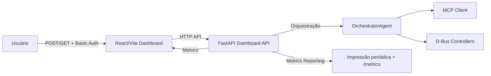

# Dashboard Architecture & Operations

## Visão geral
O dashboard FastAPI + React conecta-se ao `OrchestratorAgent` para expor planos, métricas de MCP/D-Bus e comandos manuais. Toda comunicação sensível é protegida por autenticação básica e o relatório de métricas é publicado periodicamente para ajuste fino.

## Diagrama de fluxo

## Endpoints disponíveis
| Endpoint | Descrição | Autenticação | Método |
| --- | --- | --- | --- |
| `/health` | Status mínimo sem autenticação | não | GET |
| `/status` | Plano atual, progresso e métricas consolidadas | sim | GET |
| `/snapshot` | Atualiza snapshot MCP/D-Bus e retorna | sim | GET |
| `/plan` | Visão detalhada do plano ativo | sim | GET |
| `/metrics` | Resumo de latências, erros e operações do orquestrador | sim | GET |
| `/tasks/orchestrate` | Dispara nova orquestração via `OrchestratorAgent` | sim | POST |
| `/dashboard/refresh` | Força refresh do snapshot atual | sim | POST |
| `/mcp/execute` | Aciona leituras/manipulações via MCP (action/path) | sim | POST |
| `/dbus/execute` | Aciona fluxos D-Bus (media, network, power) | sim | POST |

## Autenticação
- As variáveis `OMNIMIND_DASHBOARD_USER` e `OMNIMIND_DASHBOARD_PASS` configuram o par de credenciais.
- Todos os endpoints listados acima validam `Authorization: Basic ...` antes de executar.

## Métricas & reporting
1. Middleware registra latência por rota, status e erros.
2. Background task `_metrics_reporter` loga resumo a cada 30s (`requests`, `errors`, e `OrchestratorAgent.metrics_summary`).
3. Frontend consome `/metrics` e exibe counts, latências e operações do orquestrador.
4. `OrchestratorAgent` também mantém métricas próprias para MCP/D-Bus/of tasks a partir de `OrchestratorMetricsCollector`.

## Deploy e execução unificada
- Use `docker compose up --build` via `scripts/start_dashboard.sh` para subir backend e frontend.
- Para desenvolvimento local: ative o virtualenv, execute `uvicorn web.backend.main:app` no backend e `npm run dev` no frontend.

## Testes end-to-end
- `tests/test_dashboard_e2e.py` valida a cadeia completa (`/tasks/orchestrate`, `/metrics`, `/snapshot`) usando `TestClient`, mocks de LLM/memória e credenciais `e2e_user:e2e_secret`.
- O teste garante que o backend aceita autenticação básica, cria planos artificiais e responde com métricas e snapshots coerentes.

## Observações operacionais
- Scripts de auditoria (`ToolsFramework`) continuam registrando hash chains em `~/.omnimind/audit/tools.log`.
- A interface React exige login e exibe botões para orquestração, fluxos MCP/D-Bus e métricas em tempo real.
- `VITE_API_BASE` pode ser ajustado para apontar para ambientes distintos (ex.: contêiner Docker com host `backend`).
